# Homework-2022DotNet

## Homework1
	写在一个窗体里了
	
## Homework2
信用账户  
  
大额取款触发事件  
  
随机坏钞异常  
  

## Homework3
统计源文件的原始行数和单词数  
  
格式化源文件并统计行数、单词数和词频  
  
源文件和格式化后的文件（此处未写回原文件，而是写入新文件）  
  

## Homework4
主界面  
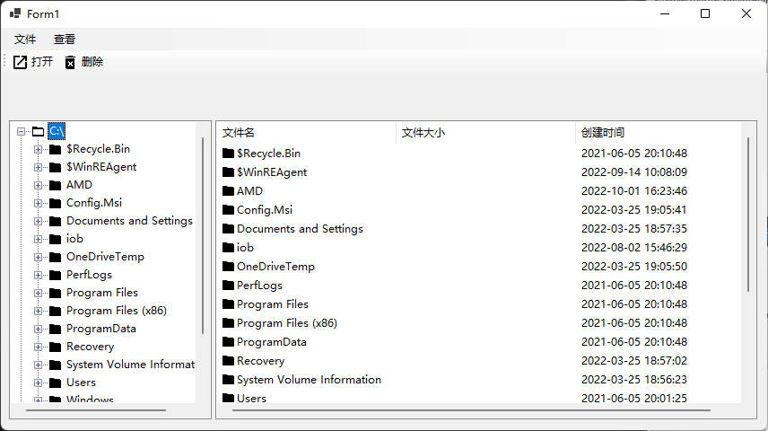  
菜单和工具栏  
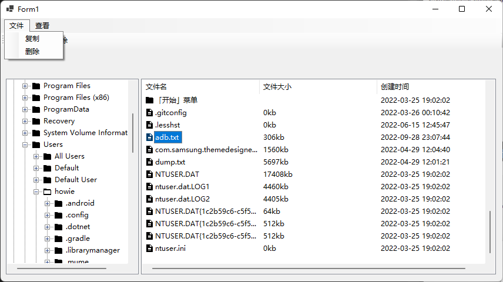  
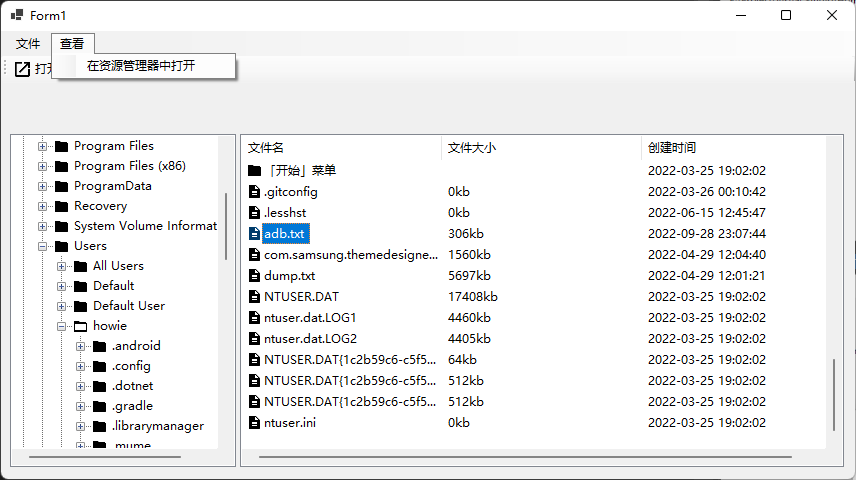  
复制功能（选择目标路径）  
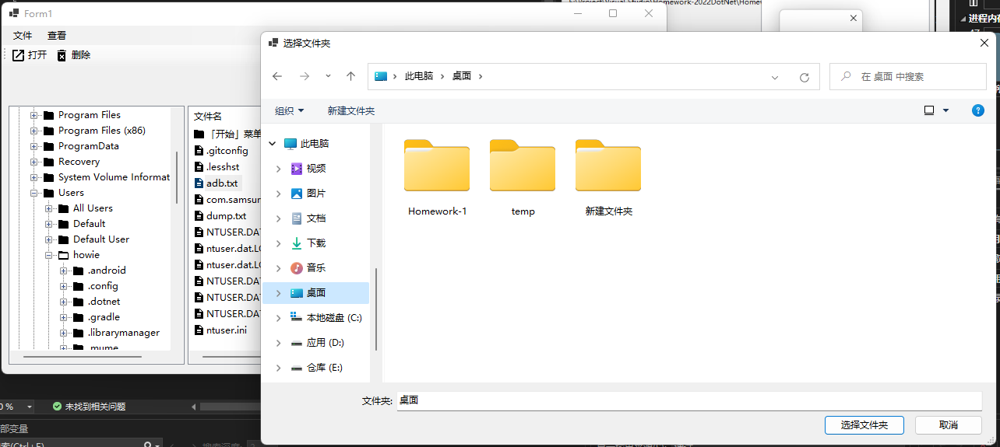  
复制功能（目标路径已有同名文件）  
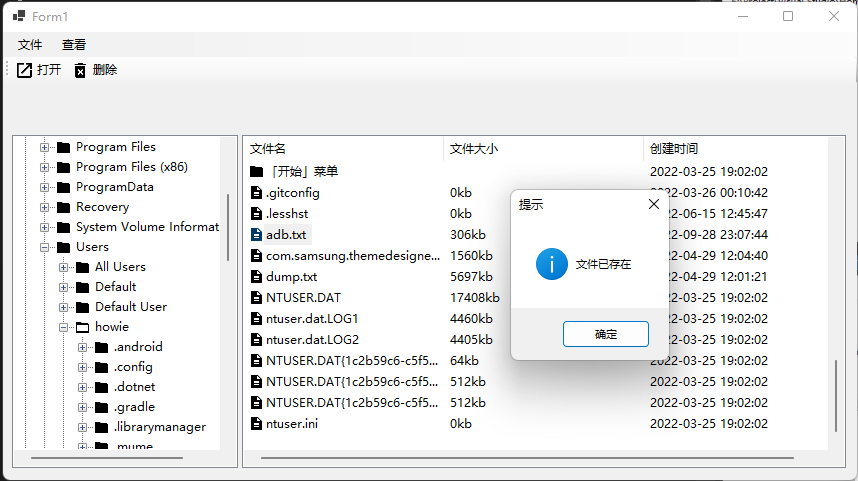  
删除功能  
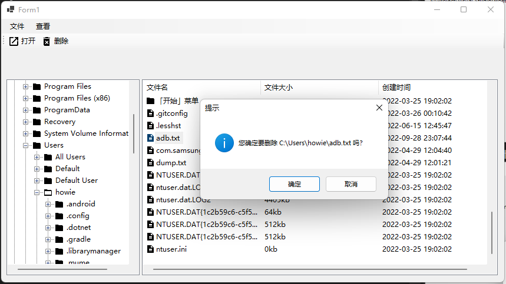  

## Homework5
运行截图   
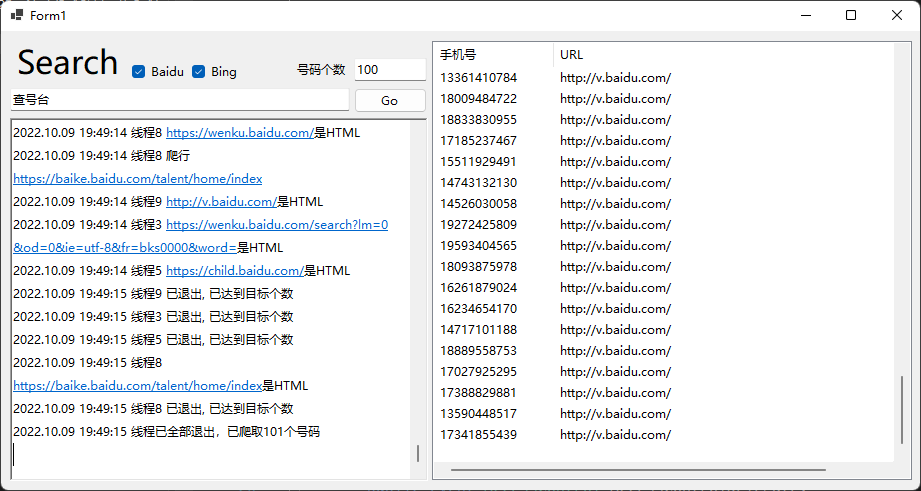   
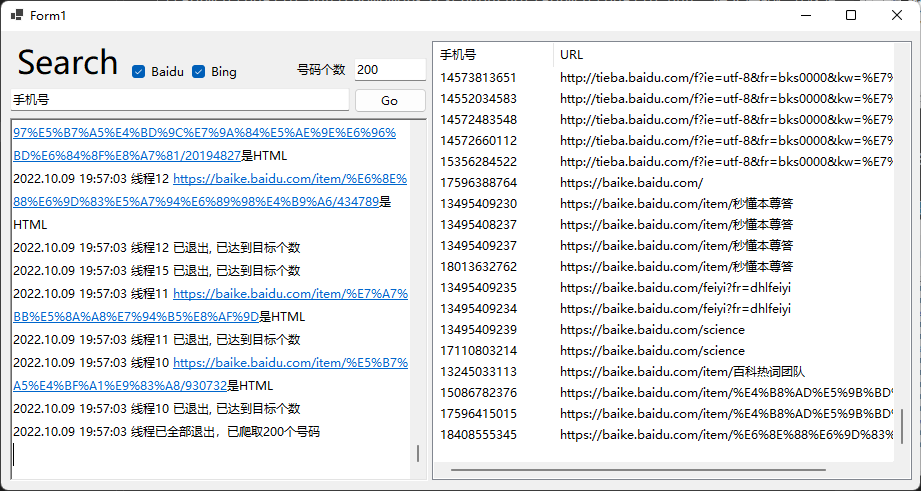   

## Homework6  
添加信息  
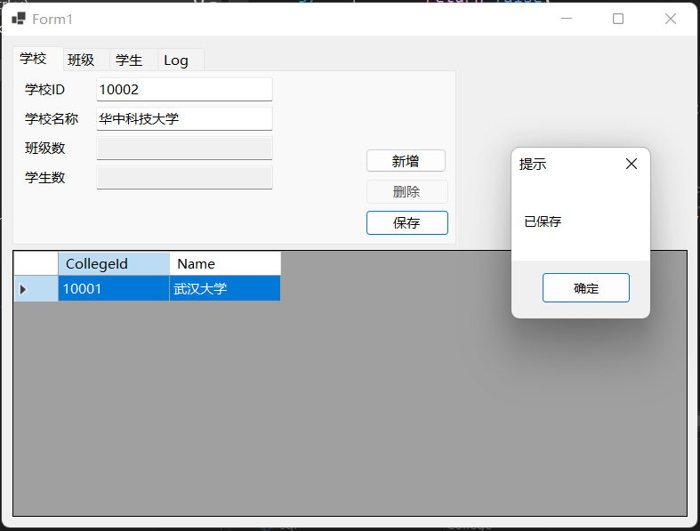  
日志  
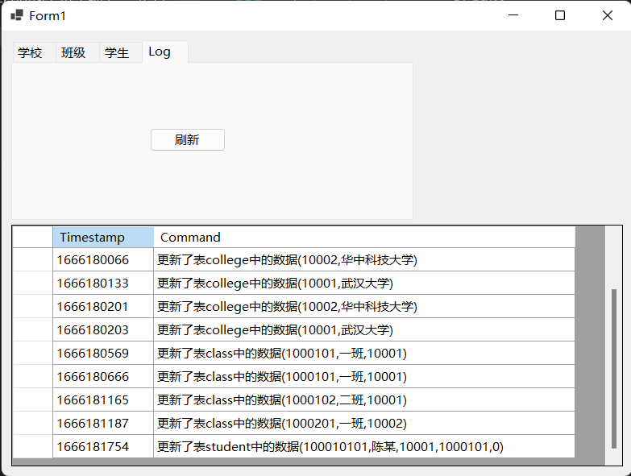  
学生表 
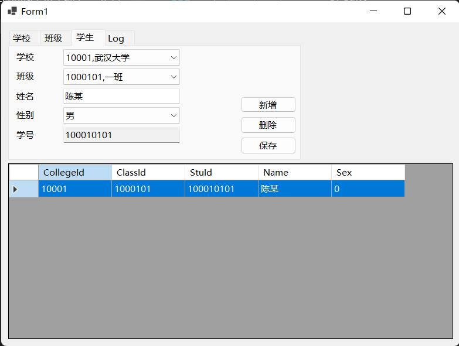  

